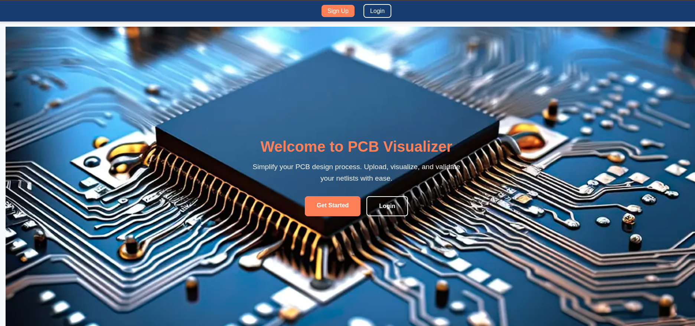
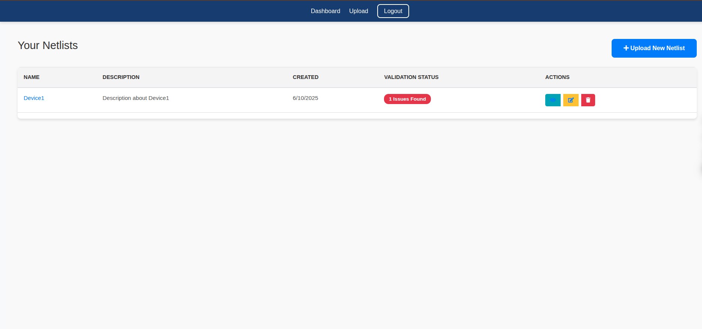
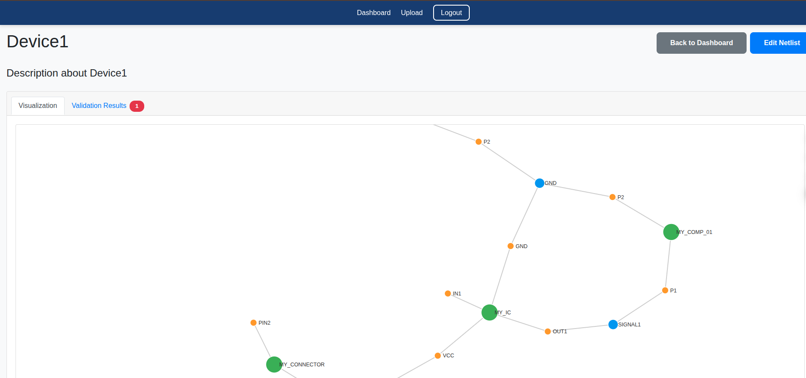

# PCB Netlist Visualizer and Validator

## Screenshots

### Landing Page


### Dashboard


### Netlist Visualization


---

PCB Netlist Visualizer and Validator is a web-based application designed to simplify the process of uploading, visualizing, and validating PCB netlists. The application provides an interactive interface for users to manage their netlists, view detailed visualizations, and validate connections. It is built with a modern tech stack and offers a responsive design for both desktop and mobile devices.

---

## Features

- **User Authentication**: Secure login and registration system.
- **Netlist Management**: Upload, edit, and delete netlists.
- **Interactive Visualization**: Force-directed graph visualization of netlists with zoom and pan functionality.
- **Validation**: Validate netlists and highlight issues in the connections.
- **Responsive Design**: Fully responsive UI for desktop and mobile devices.

---

## Tech Stack

### Frontend
- **React**: For building the user interface.
- **React Router**: For client-side routing.
- **D3.js**: For interactive data visualization.
- **Axios**: For making HTTP requests to the backend.
- **CSS**: For styling the application.

### Backend
- **Node.js**: For building the server-side application.
- **Express.js**: For handling API routes.
- **Mongoose**: For interacting with MongoDB.
- **JWT**: For user authentication and authorization.

### Database
- **MongoDB**: NoSQL database for storing user and netlist data.

### DevOps
- **Docker**: For containerizing the application.
- **Docker Compose**: For managing multi-container applications.

---

## Installation Guide

### Prerequisites
- **Node.js** (v18 or higher)
- **Docker** and **Docker Compose**
- **MongoDB** (if not using Docker)

### Steps to Run the Application

#### 1. Clone the Repository
```bash
git clone https://github.com/your-repo/pcb-netlist-visualizer.git
cd pcb-netlist-visualizer
```

#### 2. Set Up Environment Variables
Create a `.env` file in both the `server` and `client` directories. Use the provided `.env` files as templates and update the values as needed.

#### 3. Run the Application with Docker Compose
```bash
docker-compose up --build
```

This will start the MongoDB database, backend server, and frontend client.

#### 4. Access the Application
- Frontend: [http://localhost:3000](http://localhost:3000)
- Backend API: [http://localhost:5000/api](http://localhost:5000/api)

---


## License
This project is licensed under the MIT License.
